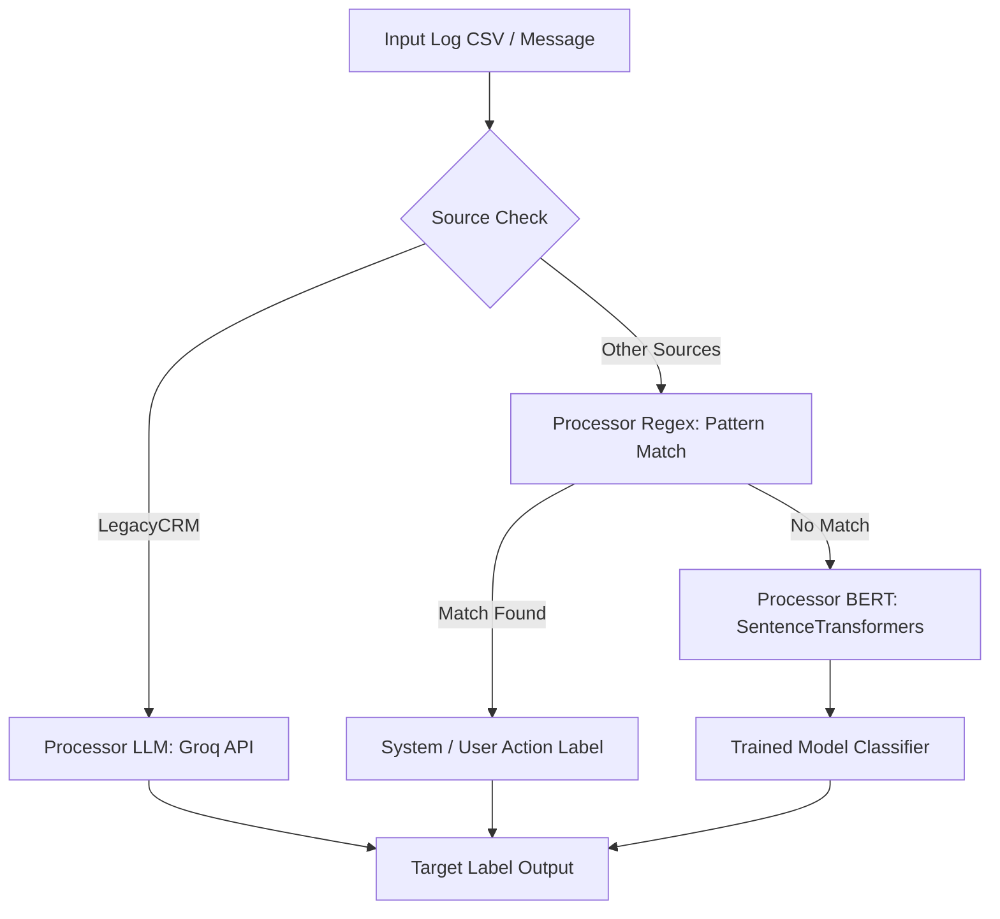

# ⚡ AI Log Classification & Intelligence System

A production-grade, hybrid ML & LLM Log Classification System that categorizes log streams (security alerts, system notifications, workflow errors, deprecation warnings, HTTP status codes, and user actions) using a multi-tiered pipeline: **Regex Engine**, **SentenceTransformers + BERT Classifier**, and **Groq LLM**.


---

## 🌟 Key Features

- 📁 **Batch CSV Log Classification**: Process bulk log files with instant category metrics, interactive tables, and CSV exports.
- ⚡ **Real-Time Log Tester**: Test individual log messages with live routing transparency.
- 🧠 **Multi-Tiered Hybrid Routing**:
  1. **Legacy System Logs (`LegacyCRM`)**: Evaluated via **Groq LLM API** (`openai/gpt-oss-20b` / `llama-3.3-70b`) for complex contextual reasoning (e.g., Workflow Errors vs. Deprecation Warnings).
  2. **Standard Logs**: Evaluated first by high-speed **Regex Pattern Engine**.
  3. **Unmatched Logs**: Encoded via **SentenceTransformers** (`all-MiniLM-L6-v2`) and classified with a trained **BERT/Logistic Regression Model**.
- 📡 **FastAPI REST API**: High-throughput REST API endpoint (`/classify/`) ready for microservice deployment.

---

## 🏗️ Architecture Pipeline



---

## 📂 Project Structure

```text
Log classification project/
├── app.py                  # Streamlit Web UI Dashboard
├── server.py               # FastAPI Server Application & Endpoint (/classify/)
├── classify.py             # Main Pipeline Router
├── processor_regex.py      # Regex Rule-based Classifier
├── processor_bert.py       # SentenceTransformers & BERT Model Classifier
├── processor_llm.py        # Groq LLM API Classifier
├── models/
│   └── log_classifier.joblib  # Pre-trained ML Classification Model
├── resources/
│   └── test.csv            # Sample Input Log Dataset
├── requirements.txt        # Production Dependencies
├── .env.example            # Environment Secrets Template
└── README.md               # Documentation
```

---

## 🚀 Quickstart & Local Setup

### 1. Clone the Repository
```bash
git clone https://github.com/SubhadeepBhadra/log-classification-project.git
cd log-classification-project
```

### 2. Create Virtual Environment & Install Dependencies
```bash
python -m venv venv
# On Windows:
venv\Scripts\activate
# On Linux/macOS:
source venv/bin/activate

pip install -r requirements.txt
```

### 3. Configure Environment Variables
Create a `.env` file in the project root based on `.env.example`:
```env
GROQ_API_KEY=your_groq_api_key_here
```

### 4. Run the Streamlit Dashboard
```bash
streamlit run app.py
```
Open `http://localhost:8501` in your browser.

### 5. Run the FastAPI REST Server
```bash
python server.py
```
The REST API endpoint will be live at `http://127.0.0.1:8000/classify/`.

---

## 📡 API Usage Example

```python
import requests

url = "http://127.0.0.1:8000/classify/"
files = {'file': ('test_logs.csv', open('resources/test.csv', 'rb'), 'text/csv')}

response = requests.post(url, files=files)

if response.status_code == 200:
    with open('classified_output.csv', 'wb') as f:
        f.write(response.content)
    print("Classification completed successfully!")
```

---

## 📜 License
Licensed under the [MIT License](LICENSE).
